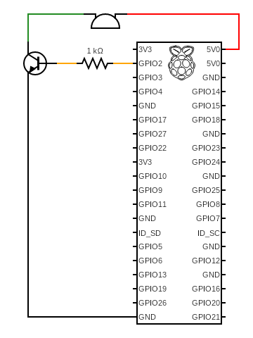
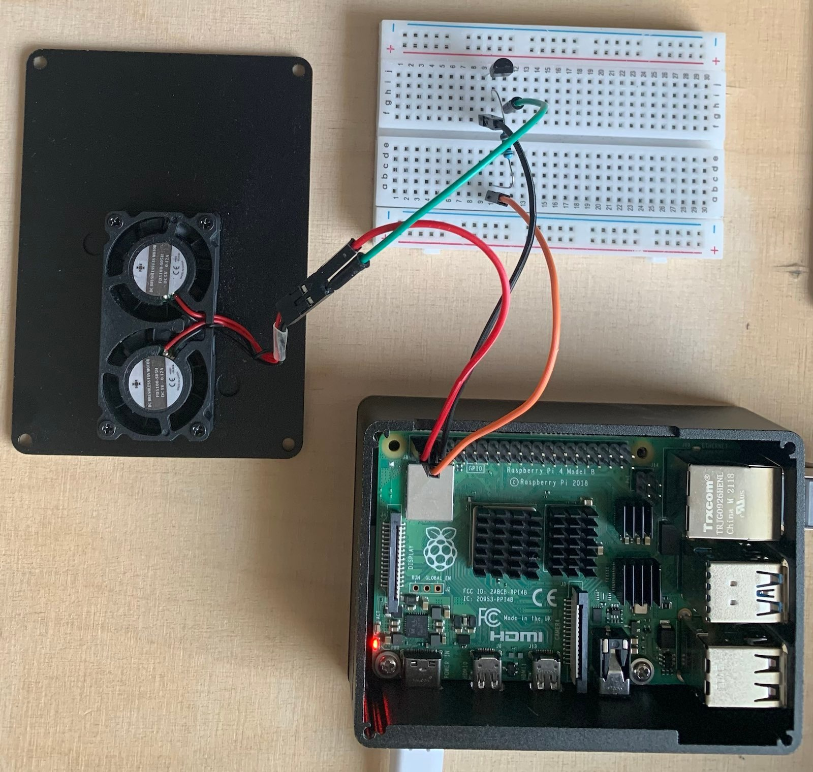

# raspberry-pi-fan

How I wired up my fan to my raspberry pi.

# Circuit

The circuit was created using [Circuit Diagram](https://www.circuit-diagram.org).

In the circuit, the fan was replaced with a buzzer.



# Build

Here's how my finished build looks:



The wire coloring matches that of the circuit.

# How to configure the fan

1. Open a terminal on the Pi
2. Enter ```sudo raspi-config```
3. Go to the forth option ```4 Performance Options```
4. Go the next forth option ```P4 Fan```
5. Select ```<Yes>``` for the option ```Would you like to enable fan temperature control?```
6. Enter your GPIO pin, in this case, 2
7. Select ```<Ok>```
8. Enter the temperature at which your fan will turn on. NOTE: The fan will only turn off if the temperature is below 10°C of the value you entered.
9. Select ```<Ok>```
10. Confirm the following: ```The fan on GPIO <your pin> is enabled and will turn on at <your temperature> degrees Celsius``` with ```<Ok>```
11. Select ```<Finish>``` to save
12. Choose what you want when you see ```Would you like to reboot now?```

# What you need to build your own

- Raspberry Pi
- 5-volt fan (in this example with female connectors)
- Breadboard
- Jumper cables:
    - 1 male-male (breadboard-fan)
    - 3 female-male (2 Pi-breadboard) (1 Pi-fan)
- 1k resistor
- 1 NPN transistor

# Testing

To get the temperature up we will use a tool called ```stress```.

Install it:

```shell
sudo apt-get install stress
```

Use it:

```shell
stress --cpu 4
```

Stop it: Hit CTRL+C

Measure the temperature:

```shell
vcgencmd measure_temp
```

Watch the temperature (measure every second):
```shell
watch -n 1 -d vcgencmd measure_temp
```

Stop watching: Hit CTRL+C
